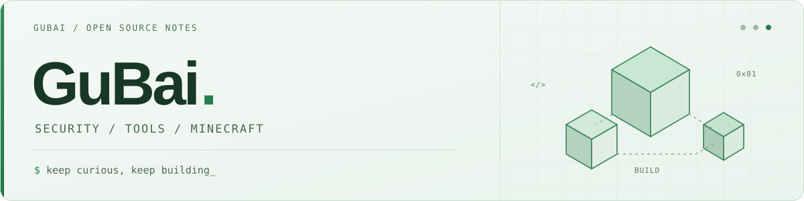

<picture>
  <source media="(prefers-color-scheme: dark)" srcset="./assets/banner-dark.svg">
  <source media="(prefers-color-scheme: light)" srcset="./assets/banner-light.svg">
  
</picture>

<h1 align="center">Hi, I'm GuBai 👋</h1>

  AI student · Information security enthusiast · Technical Minecraft player

  <a href="https://www.gubaiovo.com/">Website</a> ·
  <a href="https://blog.gubaiovo.com/">Blog</a> ·
  <a href="mailto:470014599@qq.com">Email</a>

Here you'll find my security experiments, practical projects, and a few things I've built in the world of blocks.

## Currently Exploring

- **Pwn / Linux Security**: Binary exploitation, system calls, and sandboxing, from understanding the internals to building tools.
- **Practical Tools & AI Applications**: Campus resource downloaders, handwritten journals on Android, and development with AI agents.
- **Minecraft / MCDR**: Technical Minecraft, servers, and plugins that bring ideas into the game.

## Projects

| Project | What It Is | Tech |
| --- | --- | --- |
| [elf-seccomp-patcher](https://github.com/gubaiovo/elf-seccomp-patcher) | An ELF runtime protection injector for AWD, combining seccomp-BPF and Landlock. | Python · LIEF · C |
| [JNU-EXAM-Downloader](https://github.com/gubaiovo/JNU-EXAM-Downloader) | A desktop downloader for JNU-EXAM that makes campus resources easier to access. | Go · Wails · Vue |
| [syscage](https://github.com/Find-key/syscage) | A tool for checking seccomp sandboxes. | Rust |
| [jyff-agent](https://github.com/JNSEC-OpenSource-Community/jyff-agent) | An InfoSec agent for automated CTF solving and code auditing. | TypeScript · Node.js · React |

Early Minecraft Plugins (Archived)

- [MCDR_chat_with_ai](https://github.com/gubaiovo/MCDR_chat_with_ai) — Connects Minecraft servers to DeepSeek and OpenAI-compatible models, with chat history and role presets.
- [MCDR_uuid_api_remake](https://github.com/gubaiovo/MCDR_uuid_api_remake) — A UUID API remake for player UUID lookup on online-mode and offline-mode servers.

## My Blog

- [Understanding x86-64 syscall Through RCTF](https://blog.gubaiovo.com/posts/7e474cc5.html) — Understanding system call instruction behavior through a CTF challenge.
- [An Introduction to ARM Pwn and ret2libc](https://blog.gubaiovo.com/posts/b988d4f6.html) — My first ARM Pwn experiment, from environment setup to exploitation.
- [How to Deploy Hexo Elegantly](https://blog.gubaiovo.com/posts/47ea0411.html) — Notes on blog deployment and workflows.
- [Reflections on the Past Six Months](https://blog.gubaiovo.com/posts/351c2b95.html) — Thoughts on CTF, learning, and development in the age of AI agents.

[Read more →](https://blog.gubaiovo.com/archives/)

---

  A little code, a few thoughts.

<!-- When updating projects, verify visibility, upstream sources, and archive status. Blog links are hand-picked. -->
